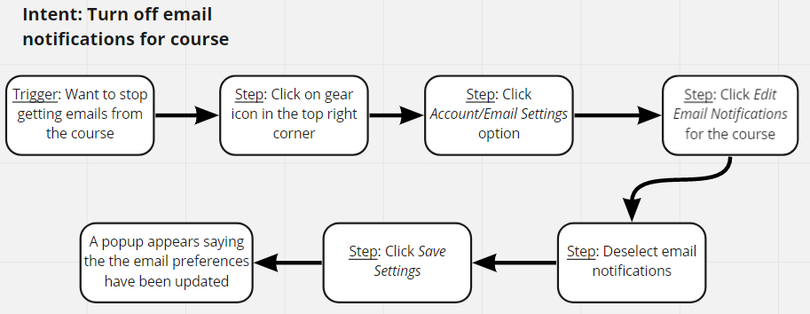

# Design Focus and Problem Space

## Overiew of Piazza

Piazza is marketed as a tool "designed to connect students, TAs, and professors so every student can get the help they need when they need it". It is a website that provides a "wiki-style Q&A" where students can post questions and get answers from professors or even other students about class content and homework clarifications. In the era of remote learning, its become a one-stop hub for all question regarding a class allowing everyone to see common questions. However, currently Piazza is quite disorganized and contains many great features that are underused as they are hard to find. In this project, we explore how we can improve the user experience for Piazza.

## Target Users

**Professor and CAs**
The professors and course or teaching assistant for the specified class are able to answer students’ questions on the Piazza forum. Professors and CA’s should be able to post information about their office hours and view information about the course easily for their own knowledge and so that they can answer any questions related to the class. In terms of short term goals, they should be able to answer students’ questions quickly and efficiently. In the long term, their goals are to ensure that everyone in the class gets the help they need.

**Students**
Students on Piazza are able to post questions to the entire class or privately to the instructors. They can also respond to others’ posts. In the short term, students aim to post their questions and obtain answers. In the long term, students use Piazza to have discussions with their fellow classmates and instructors. They would also use it to have easy access to course information, like the syllabus and office hour schedules.

## Key Problems with Piazza

As we mentioned, the main thing to keep in mind is efficiency as both students and professors want to make sure they get their answers sooner rather than later. However, as seasoned users of Piazza, its clear that the current platform is quite disorganized and to this day we are still discovering new features with Piazza. We will explore this more in our Contextual Inquiry, however here are some of the general problems we will want to address:
- No feedback after performing certain actions such as posting a response.
- It takes too many clicks to get to basic things - such as course info or your settings.
- Piazza doesn't have specific places to put content so classes put things in different places, like the syllabus.
- After clicking on a course, you are just bombarded with the threads and no info.
- Piazza has class subgroups but they are not very intuitive to use.
- Piazza’s professional network often gets in the way of trying to see things for your class.
- Students can not pin and save threads making it harder to find posts again.

# Contextual Inquiry 

To gather information on the challenges users faced while using Piazza, we performed Contextual Inquiry by having two different users perform some given tasks on the site. We will analyze the actions the users took to complete the tasks to see what ways we could improve Piazza.

## User 1: Course Assistant

### Task 1: Find the Course Syllabus

<iframe
  width="957"
  height="448"
  src="https://drive.google.com/file/d/1ZwuSBlk0rzo8uJ_2dTTA0rYE7UQNryr_/preview"
  frameborder="0"
  allowfullscreen=""
></iframe>

The subject was asked to find the course's syllabus. Using the tabs at the top, the subject first navigated to a page called "Resources". From here the subject saw that there was a large button at the top that said "Syllabus", which he clicked to access the syllabus. The subject said that if this button was not there, he would scroll down the resources page to see if the syllabus would have been posted elsewhere.

### Task 2: Turn off emails in the  Notifications settings

<iframe
  width="957"
  height="448"
  src="https://drive.google.com/file/d/1ZPCBLPK_j3z93pEIm356wmR90ORmFRS2/preview"
  frameborder="0"
  allowfullscreen=""
></iframe>

The next task was to turn off email notifications for the course. The subject first clicked on the tab called "Manage Class" at the top, but he realized that this took him to a page that contained instructor settings for the course, and figured that this would not be where he could turn off his own email notifications. Then, the subject clicked on his name in the top right corner to go to his profile, but this took him to his profile for Piazza's career website. From there, he clicked on a settings icon in the top right corner, but since he was on the Piazza careers page, it took him to settings for his career profile. The subject realized that this would not be where settings related for a course would be. The subject tried to get back to normal Piazza by clicking on the logo in the top left, but this only took him to Piazza's career homepage. After a bit, the subject realized that clicking on his profile had taken him to a new tab for the careers site, so he went back to course Piazza page by clicking on the other tab in the browser. There, the subject clicked on the gear icon in the corner, showing him an option called "Account/Email settings" that he clicked on. He scrolled down to find the course, and edited the settings to not receive any emails and saved.

### Task 3: Find the Office Hours of someone in the teaching staff

<iframe
  width="957"
  height="448"
  src="https://drive.google.com/file/d/1kn_4Qxq49DBsVIcg6RJMea9dTboOyyhF/preview"
  frameborder="0"
  allowfullscreen=""
></iframe>

For this task, the subject was asked to find the office hours of someone on the teaching staff. From his settings page, the subject clicked on the course dropdown at the top and then clicked on the course itself, but the page did not change. The subject then tried clicking on the "Resources" tab, taking him to the resources page. Here, he clicked on a tab called "Staff", where he found the office hours for the teaching staff. 

### Task 4: Make 5 Piazza groups

<iframe
  width="957"
  height="448"
  src="https://drive.google.com/file/d/18XpRl9Inwx1O-u_o6Q2XpqmYzv2fbVkw/preview"
  frameborder="0"
  allowfullscreen=""
></iframe>

The subject was tasked with creating five student groups within the piazza course, each named "Project 1", "Project 2", ... and so on. The subject clicked on the "Manage Class" tab at the top. On the page, he scrolled down a little before noticing another tab at the top that said "Create Groups". The subject clicked on the tab and was taken to the part of the page where he could manage the class groups. The subject clicked on the "Manually Create Groups" button, and two new fields appeared. The first was entitled "Create section named with same prefix" and the second was entitled "Create custom group names". The subject stared at the two options for a bit, and then clicked on on the "Create section named with same prefix" field. Here he typed in "Project", used the dropdown to select 5, and clicked the "Add" button. The new groups appeared in the list of groups for the class.

## User 2: Student

### Task 1: Find the Course Syllabus

<iframe
  width="957"
  height="514"
  src="https://drive.google.com/file/d/1hd2H9uini9YCxi7ST_jQJNjT_5P1-lEJ/preview"
  frameborder="0"
  allowfullscreen=""
></iframe>

The subject was asked to find the course's syllabus. First, the subject used the course dropdown at the top to select the course again, but the page did not change since he was already on the course's page. The subject then tried clicking through some of the post filters to see if any of the posts would mention a syllabus but he did not find one that did. The subject noticed a "Resources" tab at the top and clicked on it. He scrolling down on the "Resources" page and found the course syllabus. The subject commented that he usually doesn't use Piazza to locate a course's syllabus, instead usually checking the course's BlackBoard or checking the paper syllabus that would be handed out when classes were in person.

### Task 2: Turn off emails in the  Notifications settings

<iframe
  width="957"
  height="514"
  src="https://drive.google.com/file/d/1iZaEwjO01gzRd75hSsfdgJaqBCvPTAp4/preview"
  frameborder="0"
  allowfullscreen=""
></iframe>

The next task was to turn off email notifications for the course. The subject made a point to notice that he finds Piazza emails annoying, and has done this task before. From the course page, he clicked on the gear icon in the top right corner and then clicked on option that said "Account/Email settings". The subject scrolled down the section entitled "Class & Email Settings" and was able to disable emails for the course.

### Task 3: Find the office hours of someone in the teaching staff

<iframe
  width="957"
  height="514"
  src="https://drive.google.com/file/d/1zMOYFmUgwQlvQ-As11zCm-Anbfa_2Q8x/preview"
  frameborder="0"
  allowfullscreen=""
></iframe>
 
For this task, the subject was asked to find the office hours of someone on the teaching staff. From his settings page, the subject clicked on the course dropdown at the top and then clicked on the course itself, but the page did not change. The subject tried this again but the page still did not change. After this, the subject clicked on "Resources" to go to the resources page. From here, he scrolled down and clicked on the syallbus again, and found the office hours listed there.

### Task 4: Join a group and find a post from it

<iframe
  width="957"
  height="514"
  src="https://drive.google.com/file/d/1SMjUxxti2cn7hbEoE-iy9zT5zbkw4y2e/preview"
  frameborder="0"
  allowfullscreen=""
></iframe>

The final task was for the subject to join one of the student groups in the course. From the resources page, the subject was able to immediately notice a "Groups" tab which took him to a list of groups. The subject was told to join "Group 2". Then, the subject was asked to try and find a post within this group. The subject clicked on the "Q & A" tab at the top and then started scrolling through the posts. He found one that was marked with a "Group 2" label, and clicked on it. The subject also noted that on the post, he could click on the "Group 2" label to find more posts in the group.

## Flow Model


## Sequential Model

### Task 1


### Task 2




# Ideation

Performing contextual inquiry with two different users allowed us to discover some flaws in Piazza's user interface. These flaws mainly had to do with Piazza's layout, organization, and navigation.

First, Piazza's buttons and menu items are not clear enough. During contextual inquiry, there were multiple times where the subjects clicked on the incorrect button or option because it sounded like the right choice. For example, the first subject clicked on the "Manage Class" tab, believing it would contain his personal settings for the class, but instead it was the course-wide settings. This subject also clicked on his profile to try and find these settings, but it instead took him to his profile for a separate part of Piazza, and he had trouble getting back.

Some crucial aspects of Piazza are not emphasized as much as they should be. The navigation bar at the top is tiny when compared to the rest of the site. During contextual inquiry, when giving a task, our subjects would first look around the big, main Piazza page below the nav bar, before noticing that all the options are up top. Since this is where most of the options and buttons are, it should be made bigger so that users spend less time trying to find it. Additionally, since our first subject got completely side-tracked in one task by Piazza's career site, we believe it should be completely separated from the Piazza courses site to avoid confusion.

The Resources page is where much of the important information pertaining to a course is located, but it is hidden behind a small tab at the top. Although Piazza, is mainly used a forum to supplement course's already existing pages, due to remote learning, students are spending more time on Piazza than before. The Resources page should be upgraded to have a bigger role on Piazza. The sub-tabs on the Resources page, "Course Information", "Staff", "Resources", and "Groups", should be more obvious to students. Our second subject chose to look at the syllabus rather than the "Staff" tab to find the professor's office hours, but had he noticed the "Staff" tab, he would have been able to stay within Piazza and the experience would be more streamlined.

Overall, in its current state, Piazza's layout is unclear and unintuitive.

# Prototype

# Evaluation


## Welcome to GitHub Pages

You can use the [editor on GitHub](https://github.com/adalmia123/adalmia123.github.io/edit/master/README.md) to maintain and preview the content for your website in Markdown files.

Whenever you commit to this repository, GitHub Pages will run [Jekyll](https://jekyllrb.com/) to rebuild the pages in your site, from the content in your Markdown files.

### Markdown

Markdown is a lightweight and easy-to-use syntax for styling your writing. It includes conventions for

```markdown
Syntax highlighted code block

# Header 1
## Header 2
### Header 3

- Bulleted
- List

1. Numbered
2. List

**Bold** and _Italic_ and `Code` text

[Link](url) and 
```

For more details see [GitHub Flavored Markdown](https://guides.github.com/features/mastering-markdown/).

### Jekyll Themes

Your Pages site will use the layout and styles from the Jekyll theme you have selected in your [repository settings](https://github.com/adalmia123/adalmia123.github.io/settings). The name of this theme is saved in the Jekyll `_config.yml` configuration file.

### Support or Contact

Having trouble with Pages? Check out our [documentation](https://help.github.com/categories/github-pages-basics/) or [contact support](https://github.com/contact) and we’ll help you sort it out.
